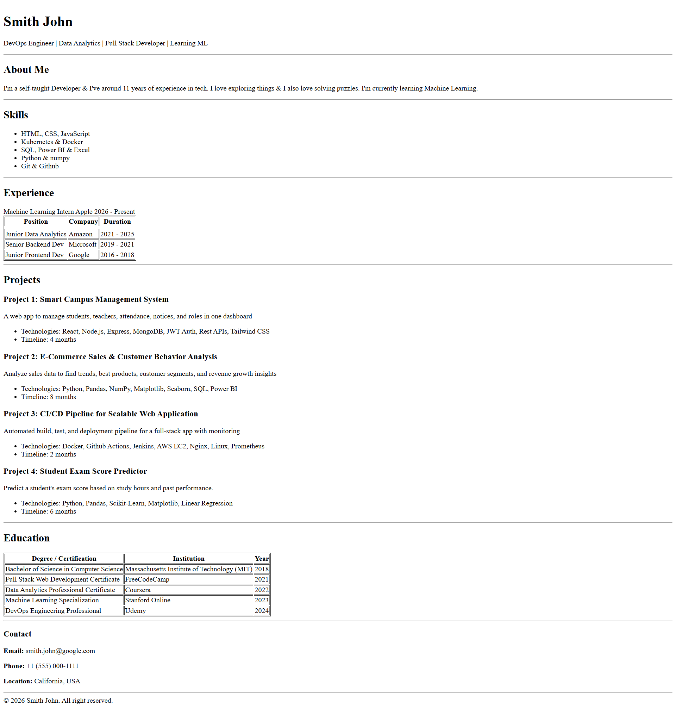

# HTML Portfolio Website

A simple HTML portfolio website built for learning purposes.

## Preview



> **Disclaimer:** This portfolio website uses dummy data and is created for learning purposes only.

## Main Features

- Sections included: **About**, **Skills**, **Experience**, **Education**, and **Projects**
- Built with **pure HTML** (no CSS used)
- Uses **semantic HTML tags** for better structure and accessibility

## Setup Instructions

1. Create a folder on your local machine.
2. Open the folder in **VS Code**.
3. Clone the repository:
   ```bash
   git clone https://github.com/MuhammadPhulpoto/Porfolio-Website-using-only-HTML---Cohort-Assigment
   ```
4. Run Live Server
5. Preview appears
